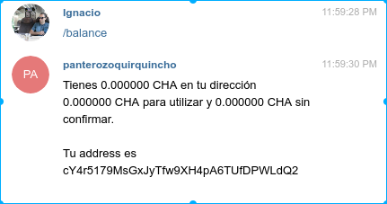

# Quirquincho

*Read this in other languages: [Spanish](README.md), [English](README.en.md)*
 
This is the source code of the Quirquincho bot ([QuirquinchoBot](https://t.me/QuirquinchoBot)), used to send and receive [Chauchas](https://www.chaucha.cl) through Telegram.
 
## Installation
 
The first thing to do is install the needed premises so the program can be implemented.
 
The [pip](https://pip.pypa.io/en/stable/) program, allow us to install programs that will be useful for this project . In [Debian](https://www.debian.org/index.es.html)-based operating systems, we need to run the following:
 
```
sudo apt-get install python3-pip
```
With pip we will install the python packages needed to run our bot.
 
Now we will install the premises:
```
pip3 install setuptools python-telegram-bot bitcoin requests
```
We install [git](https://git-scm.com/) to clone the project.
```
sudo apt-get install git
```
 
Now we get the Quirquincho bot from the official repository of Proyecto Chaucha.
 
```
git clone https://github.com/proyecto-chaucha/quirquincho.git
```
 
Once the repository is cloned, we enter to the **quirquincho/** folder and modify the setting file ***config.py***.
 
## Settings
 
In the ***config.py*** file, the following fields must be indicated:
 
### Token
This token is given by the Telegram [@BotFather](https://t.me/BotFather), once a new bot is created with the ***/newbot*** command.
 
```
token = "588345908:AAHEv4vsdfsdosI6umO_VYerwaasdoATQI5vPrY"
```

### Salt
This is a secret key which will allow you to create different Chaucha Wallets according to the Telegram's ID. The access to these Wallets will be lost if this key changes.
```
salt = "\xd1r\xe5\x8fy\x02\xbd\xadl\x14m1S]s\xfdiPF\xacu[\x11\x9f\x08\x1a\xb0\xee\xa6\xdbu\xa7"
```
## Running

Thus, we can already run a bot like this:

```
python3 __main__.py
```
Or like this:
```
python3 .
```

We should see something similar to the following:

<div align="center">
        <a href="Resources/pythonInit.png">
                
        </a>
</div>

If we now enter Telegram, and write to the bot that we just created (in my case @panterozoquirquinchobot), we will see it working correctly when given a running command like ***/balance***.

<div align="center">
        <a href="Resources/balanceFromTelegram.png">
                
        </a>
</div>

As long as the bot is in our machine, it will show the information received from Telegram: 

<div align="center">
        <a href="Resources/balance.png">
                
        </a>
</div>

Note that the information in the console and the one sent to telegram has to be the same.

## Installation through Docker

The [Docker](https://www.docker.com/) technology allows us to package the necessary dependencies for our projects in the ***containers***. To run **quirquincho** with Docker, the settings file ***Dockerfile*** found in the repository was used.

```
# We select the image for python
FROM alpine:3.7
# We update pip and install setuptools
RUN apk add --no-cache python3 && \
    python3 -m ensurepip && \
    rm -r /usr/lib/python*/ensurepip && \
    pip3 install --upgrade pip setuptools
# We install the python package for Telegram, bitcoin package and requests package***
RUN pip3 install python-telegram-bot bitcoin requests
# We define our work space in the container
WORKDIR /usr/src/quirquincho
# We copy our source to the container
COPY . /usr/src/quirquincho
# We run our project with python3
CMD ["python3","."]
```
Once it is set as mentioned before, the project must be built. To build our working space, we must run the following command:
```
docker build -t quirquincho .
```


followed by:
```
docker run -it quirquincho
```
With this, we will have our bot running from a **Docker**.

