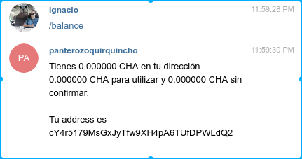
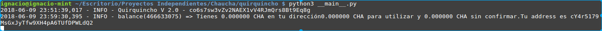

# Quirquincho

*Read this in other languages: [Spanish](README.md), [English](README.en.md)*

Este es el código fuente del bot Quirquincho ([QuirquinchoBot](https://t.me/QuirquinchoBot)), utilizado para enviar y recibir [Chauchas](https://www.chaucha.cl) a través de Telegram.

## Instalación

Lo primero a realizar es instalar las dependencias necesarias para que el programa pueda ser ejecutado.

El programa [pip](https://pip.pypa.io/en/stable/), nos permite instalar programas que serán de utilidad en este proyecto. En sistemas operativos basados en [Debian](https://www.debian.org/index.es.html), debemos ejecutar lo siguiente:

```
sudo apt-get install python3-pip
```
Con pip instalaremos los paquetes python necesarios para ejecutar nuestro bot.

Instalamos ahora las dependencias:
```
pip3 install setuptools python-telegram-bot bitcoin requests redis
```
Instalamos [git](https://git-scm.com/) para poder clonar el proyecto.
```
sudo apt-get install git
```

Ahora obtenemos el bot Quirquincho desde el repositorio oficial del Proyecto Chaucha.

```
git clone https://github.com/proyecto-chaucha/quirquincho.git
```

Una vez clonado el repositorio, entramos a la carpeta **quirquincho/** y modificamos el archivo de configuración ***config.py***.

## Configurando

Cambia el nombre del archivo **config.py.example** a **config.py** e ingresa los siguientes campos:

### Token
Este token es entregado por el [@BotFather](https://t.me/BotFather) de telegram, una vez que creado un nuevo bot con el comando ***/newbot***.

```
token = "588345908:AAHEv4vsdfsdosI6umO_VYerwaasdoATQI5vPrY"
```

### Salt
Esta es una llave secreta que te permitirá crear diferentes Wallets chaucha según el id de telegram. Si esta clave cambia, entonces el acceso a estas wallets se perderá.
```
salt = "\xd1r\xe5\x8fy\x02\xbd\xadl\x14m1S]s\xfdiPF\xacu[\x11\x9f\x08\x1a\xb0\xee\xa6\xdbu\xa7"
```
## Ejecución

Con ello, ya podemos ejecutar el bot así:

```
python3 __main__.py
```
O así:
```
python3 .
```

Deberíamos ver algo similar a lo siguiente:

<div align="center">
        <a href="Resources/pythonInit.png">
                
        </a>
</div>

Si ingresamos ahora a telegram, y le escribimos al bot que acabamos de crear (en mi caso @panterozoquirquinchobot), notaremos que se encuentra funcionando correctamente al entregarle un comando de ejecución como ***/balance***.

<div align="center">
        <a href="Resources/balanceFromTelegram.png">
                
        </a>
</div>


Mientras que el bot en nuestra máquina, mostrará la información recibida desde Telegram:
 
<div align="center">
        <a href="Resources/balance.png">
                
        </a>
</div>

Fijarse que la misma información en la consola es la enviada hacia telegram.

## Instalación mediante Docker

La tecnología [Docker](https://www.docker.com/) nos permite empaquetar las dependencias necesarias para nuestros proyectos en los llamados ***containers***. Para ejecutar **quirquincho** con docker, se utilizó el archivo de configuración ***Dockerfile*** presente en el repositorio.

```
# Seleccionamos la imagen para python
FROM alpine:3.7
# Actualizamos pip e instalamos setuptools
RUN apk add --no-cache python3 && \
    python3 -m ensurepip && \
    rm -r /usr/lib/python*/ensurepip && \
    pip3 install --upgrade pip setuptools
# Instalamos paquete pyton para telegram, paquete bitcoin y paquete requests
RUN pip3 install python-telegram-bot bitcoin requests redis
# Definimos nuestro espacio de trabajo en el container
WORKDIR /usr/src/quirquincho
# Copiamos nuestro fuente al container
COPY . /usr/src/quirquincho
# Ejecutamos nustro proyecto con python3
CMD ["python3","."]
```

Una vez configurado como se indicó más arriba, el proyecto debe construirse. Para construir nuestro espacio de trabajo, debemos ejecutar el siguiente comando:

```
docker build -t quirquincho .
```

Seguido de 

```
docker run -it quirquincho
```
De esta manera, tendremos nuestro bot corriendo desde un **Docker**.


## Configurar listado de comandos

Desde el  [@BotFather](https://t.me/BotFather) ejecutar el siguiente comando y seleccionar bot:

```
/setcommands
```

Pegamos el siguiente texto (En construccion):

```
balance - consultar saldo y address
send - enviar chauchas
sendall - enviar todas tus chauchas (deprecado)
qr - código qr de tu address
start - mensaje de bienvenida
op_return - almacena información en el blockchain
define - busca definiciones de torpedo chauchistico
precio - muestra el precio de ciertas monedas
azar - retorna un número al azar
```
